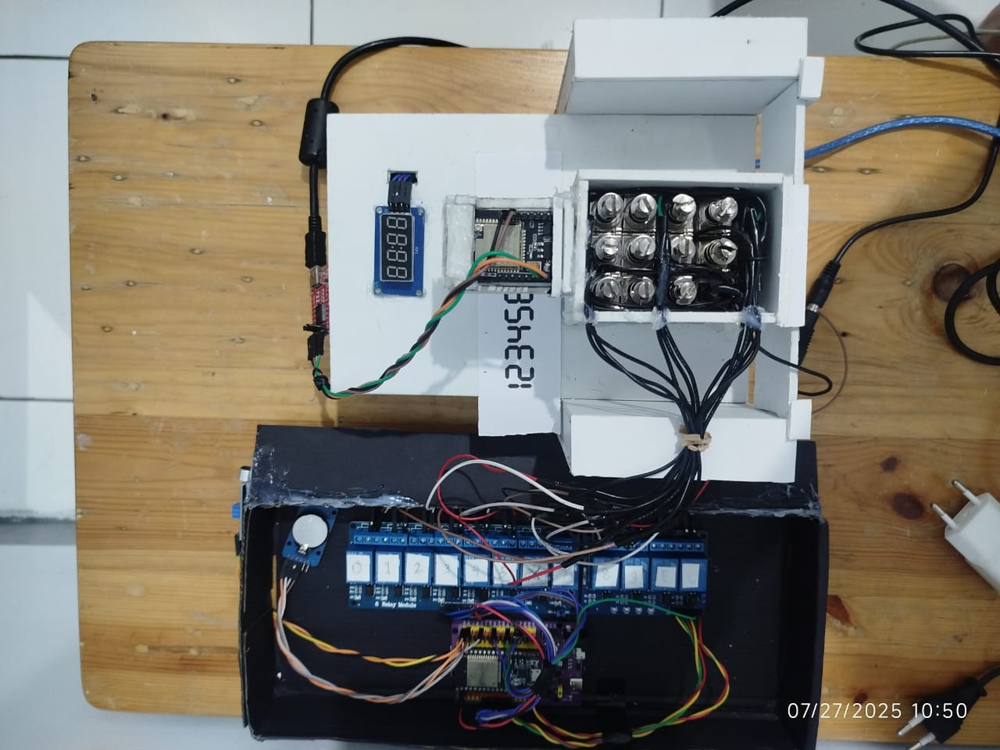
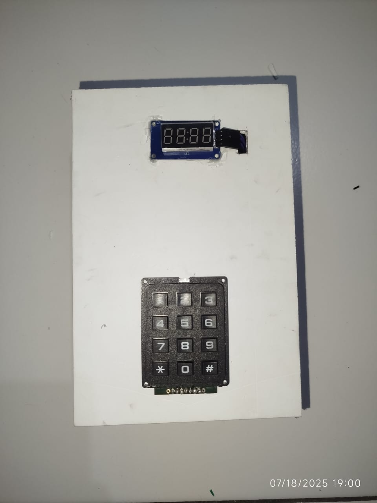
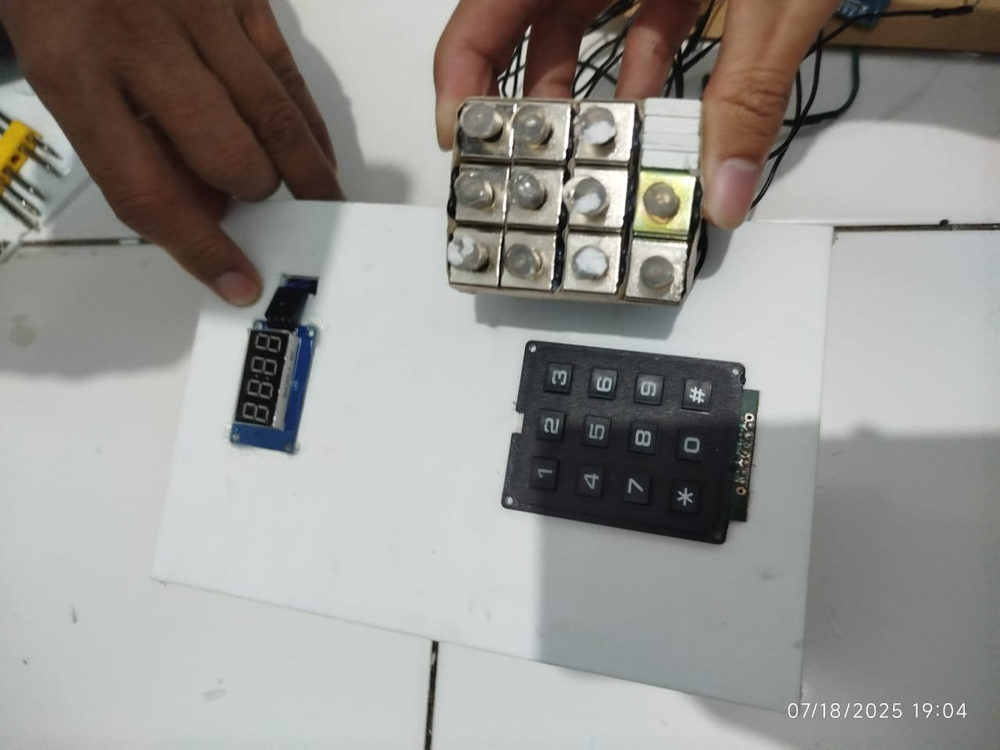
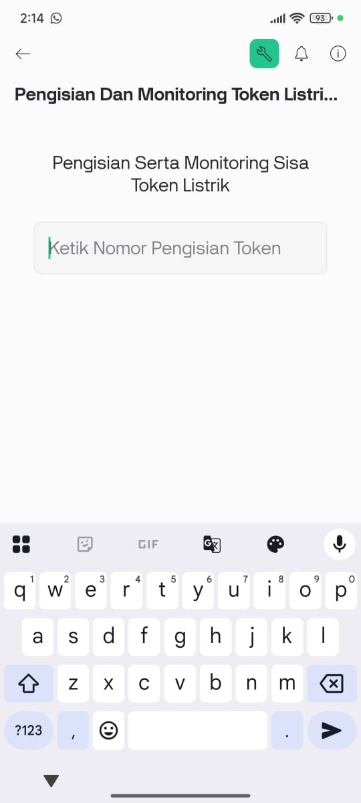
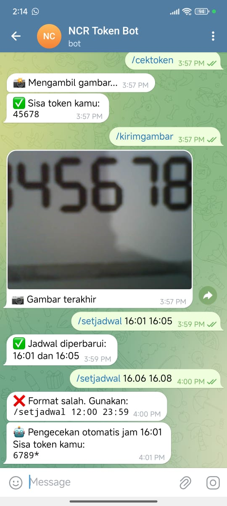

# Smart Token Monitoring & Input System using ESP32, ESP32-CAM, OCR, Telegram & Blynk

## 📌 Deskripsi Proyek
Sistem ini dirancang untuk membantu pengguna untuk melakukan pengisian dan monitoring **sisa token listrik&** secara otomatis menggunakan kombinasi **ESP32**, **ESP32-CAM**, **RTC DS3231**, dan **OCR (Optical Character Recognition)**.
Untuk melakukan pengisian ini melalui **Blynk**, dan monitoring ini melalui **Telegram Bot**, pengguna dapat melakukan input nomor pengisian token listrik pada Blynk dan pengguna dapat mengirim perintah atau mengatur jadwal pengecekan token. Gambar dari layar 7-segment diambil oleh ESP32-CAM, diproses oleh PC dengan Python, dan hasilnya dikirim kembali melalui Telegram serta disimpan ke Firebase.

## 🧩 Komponen Sistem
- ESP32 38 Pin (Mikrokontroler utama)
- ESP32-CAM (Pengambil gambar layar meteran)
- RTC DS3231 (Real-time clock untuk penjadwalan)
- PC (menjalankan skrip Python & OCR)
- Blynk
- Telegram Bot
- Firebase Realtime Database

## 🚀 Fitur Utama
1. Pengecekan Token Otomatis
   - Mengambil gambar display KWH meter menggunakan ESP32-CAM berdasarkan jadwal dari Firebase.
   - Melakukan OCR (pengenalan karakter) untuk membaca sisa token.
   - Mengirim hasil ke Firebase dan Telegram secara otomatis.
2. Pengecekan Manual via Telegram
   - Melalui perintah /cektoken, pengguna dapat memicu pengambilan gambar dan menerima sisa token melalui bot Telegram.
3. Pengisian Token via Blynk
   - Sistem menggunakan relay dan solenoid untuk menekan tombol fisik keypad token.
   - Nomor token dikirim dari aplikasi Blynk, lalu solenoid menekan angka-angka token secara otomatis.

## 📲 Cara Kerja Singkat
1. Telegram menerima perintah /cektoken → kamera aktif → gambar diproses → hasil dikirim kembali ke Telegram dan Firebase.
2. Sistem pengecekan otomatis dilakukan berdasarkan waktu dari RTC dan jadwal dari Firebase.
3. Jika token habis, pengguna bisa mengisi melalui aplikasi Blynk → sistem menekan keypad sesuai nomor token yang diberikan.

## 📎 Lisensi
Proyek ini bersifat open-source. Silakan digunakan, dimodifikasi, atau dikembangkan lebih lanjut untuk keperluan akademik maupun pribadi.

## 📸 Dokumentasi Alat

**Gambar**: Tampilan alat yang sudah dirakit dan siap diuji coba.

**Gambar**: Tampilan alat sebagai meteran listrik

**Gambar**: Tampilan solenoid sebagai penekan keypad pada implementasi meteran

**Gambar**: Tampilan melakukan pengisian token listrik melalui Blynk

**Gambar**: Tampilan melakukan monitoring sisa token listrik secara otomatis maupun manual melalui Telegram

